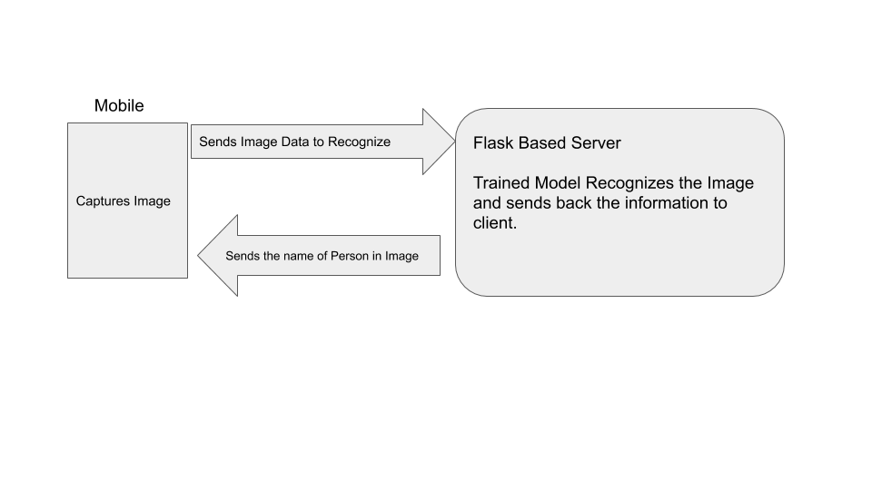

# Facial-Recognition-Based-Attendance-App

This project is for designing a mobile based Facial Attendance Recognition System.

Aim of Project:Automate the flow of taking attendance.

Mobile Application: React Native
Backend Server: Flask

Architechture Till Now:

Run the following to test the App:

Server.py ---> python Server.py
Goto React Native App Directory and press:
npm install
npm start

# TO DO:
1. Create an Attendance System Database Architechture
2. Give the App ability to record Attendance

